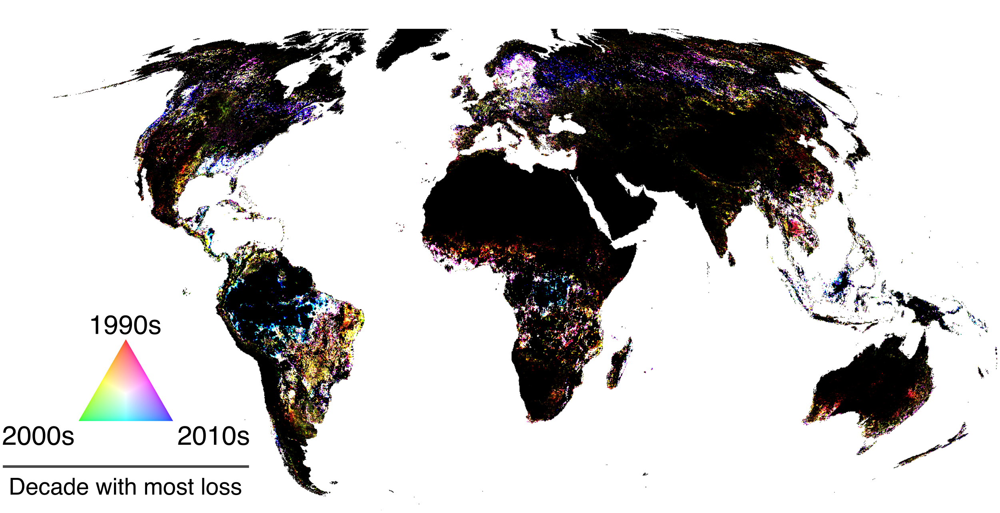

## Description

Losses and gains in canopy cover of the world’s tree canopies affect carbon stocks, species habitats, water cycles, and human livelihoods. Consistent and multi-decadal global data on tree-canopy cover dynamics are needed for modelling climate scenarios, tracking progress towards restoration targets, and diverse other research, management and policy applications. However, most data only map binary ‘forest’/‘non forest’ distinctions that are regionally restricted or biassed by data gaps, and those mapping tree-canopy cover are limited to the 21st century. Here, we present an annual and global time-series of tree-canopy cover between 1992 and 2018. To develop these data, we integrated complementary products, using their respective strengths to compensate for weaknesses, and exploiting path dependencies in change processes to derive predictions into the data-sparse 1990s. Our model validation indicates we can accurately map tree-canopy cover (r2=0.95 [±0.01], RMSE=6.75% [±0.08], F1-score=0.97 [±0.0]) and our time-series agree well with national forest statistics (r2=0.94 [±0.0]).

## Algorithm
To be filled as soon as the pre-print is out. Stay tuned.

